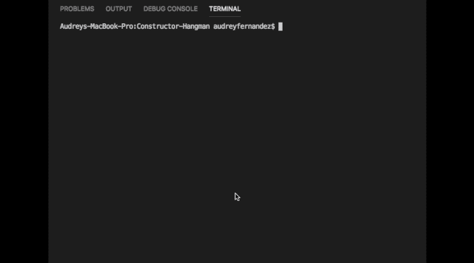

# Welcome to Marvel Superhero Word-Guess

This is a command-line word guess game in which the player will guess the name of a random Marvel superhero. Run the index.js file from terminal to start the game. The game will choose from an array of superheros and display blanks for each letter in the chosen word. The player will get 1 chance for each letter in the word plus 5 extra chances to guess the chosen superhero and win the game.

## Word Guess Command Line Sample

## Technologies and Required Packages Used
* Javascript
* Node.js
* Inquirer Node Package Module https://www.npmjs.com/package/inquirer
